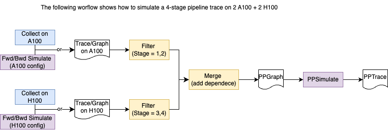

# PerFlow-AI
PerFlow-AI is an ***open-source*** **programmable** performance analysis, modeling, prediction **tool(box)** for AI systems. 

PerFlow-AI provides components, including *memory*, *offloading*, and *parallel strategies*, for building AI system performance simulators in different scenarios. 

AI system researchers can quickly **evaluate performance benifits** through simulation based on PerFlow-AI in advance before building a new architecture AI system or implementing specific optimizations.

**PerFlow-AI is under continuous development!** 🔥

We welcome AI system researchers to use it, and we welcome everyone to provide valuable suggestions for PerFlow-AI during the trial process!

## How to use PerFlow-AI

### 0. Installation
```
pip install .
```

### 1. Test
```
pytest tests/
```

### 2. Usage
We provide a set of components/sub-tasks, including `reader`,`simulator`,`visualizer`,`trace_op`, etc. 
Researchers should use thes components by organizing them as a workflow diagram. 

We use an example to further illustrate the usage. The following example shows the workflow of building a pipeline simulator for AI training on heterogenous resource (A100, H100, etc.).



```python
from perflowai.parallel.pipeline_parallel.ppgraph import PipeCostConfig
from perflowai.parallel.pipeline_parallel.zerobubble import ZeroBubbleGraph, ScheduleType
from perflowai.simulator.pp_simulator import PPSimulator, PipeType
from perflowai.visualizer.trace_visualizer import TraceVisualizer
from perflowai.trace_op.filter import Filter
from perflowai.trace_op.merge import Merge
from perflowai.core.event import EventType

def Heterogeneous_ZBV_Simulate_Visualize():
    
    # Setup pipeline configurations on A100 and H100.
    config_h100 = PipeCostConfig(fwd_time = 1315, bwd_time = 2733, wgt_time = 2650)
    config_a100 = PipeCostConfig(fwd_time = 2743, bwd_time = 4563, wgt_time = 4324)
    
    nstages = 8
    nmicrobatches = 10
    nchunks = 2

    # Build tasks and dependence between tasks for pipelines on A100 and H100, respectively.
    g_h100 = ZeroBubbleGraph(nstages, 
                            nmicrobatches, 
                            nchunks, 
                            cost_config = config_h100, 
                            schedule_type = ScheduleType.ZBV)
    g_a100 = ZeroBubbleGraph(nstages, 
                            nmicrobatches, 
                            nchunks, 
                            cost_config = config_a100, 
                            schedule_type = ScheduleType.ZBV)
    g_h100.build_graph()
    g_a100.build_graph()

    # Get part stages from the A100 pipeline and H100 pipeline
    subg_h100 = Filter().filter(g_h100, [0, 1, 2, 3])
    subg_a100 = Filter().filter(g_a100, [4, 5, 6, 7])


    # Merge the two part stages and add inter-part data dependence (data dependence could be autoimatically generated, we are refining this part.)
    res_edge_list = []

    for mb in range(nmicrobatches):
        for chk in range(nchunks):
            if (chk & 1):
                src1_id = g_h100.get_event_id(EventType.FWD, 4, mb, chk)
                dst1_id = g_a100.get_event_id(EventType.FWD, 3, mb, chk)
                res_edge_list.append([src1_id, dst1_id])

                src2_id = g_h100.get_event_id(EventType.BWD, 3, mb, chk)
                dst2_id = g_a100.get_event_id(EventType.BWD, 4, mb, chk)
                res_edge_list.append([src2_id, dst2_id])
            else:
                src1_id = g_h100.get_event_id(EventType.FWD, 3, mb, chk)
                dst1_id = g_a100.get_event_id(EventType.FWD, 4, mb, chk)
                res_edge_list.append([src1_id, dst1_id])

                src2_id = g_h100.get_event_id(EventType.BWD, 4, mb, chk)
                dst2_id = g_a100.get_event_id(EventType.BWD, 3, mb, chk)
                res_edge_list.append([src2_id, dst2_id])
    

    g = Merge().merge([subg_h100, subg_a100], res_edge_list)

    # Simluation
    trace = PPSimulator(PipeType.Interleaved1F1B, g).run()

    # Visualization
    TraceVisualizer(trace).visualize()

```

The output result is a `trace.svg`:


## Developers
PerFlow-AI was created and developed by Yuyang Jin, Xirui Shui, Runxin Zhong, Mingshu Zhai, Kezhao Huang, Jiaao He, Zan Zong, and Jidong Zhai.


## Cite

```tex
@misc{perflowai2024jin,
      title={PerFlow-AI: a programable performance analysis, modeling, prediction tool for AI systems},
      author={Yuyang Jin, Xirui Shui, Runxin Zhong, Mingshu Zhai, Kezhao Huang, Jiaao He, Zan Zong, and Jidong Zhai},
      year={2025},
      publisher = {GitHub},
      howpublished = {\url{https://github.com/yuyangJin/PerFlow-AI}},
}
```
