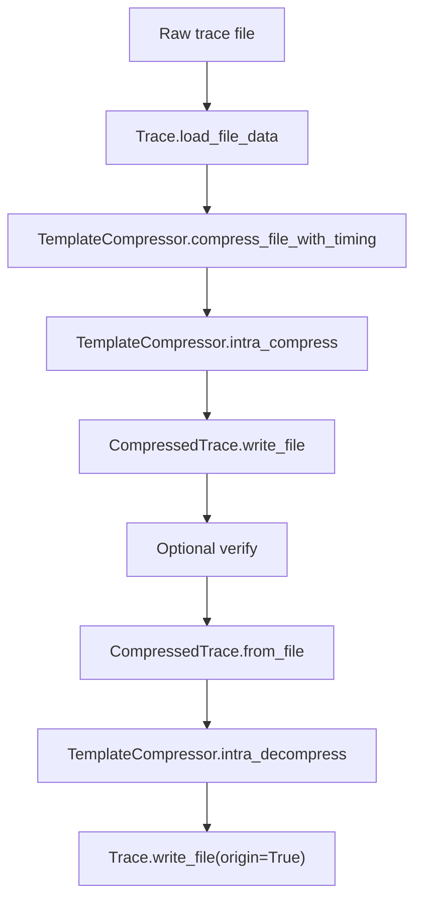
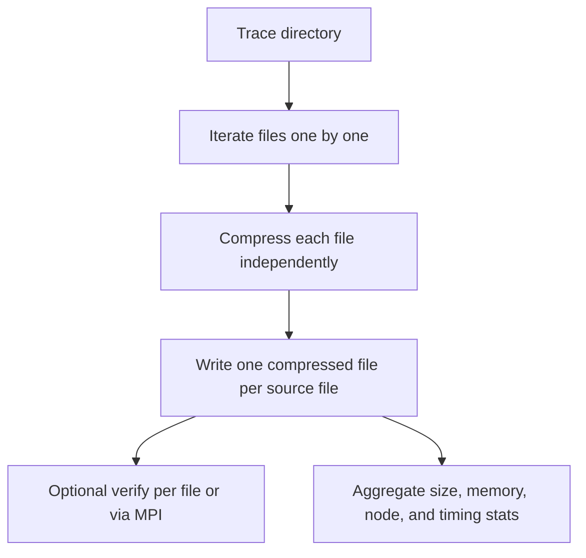
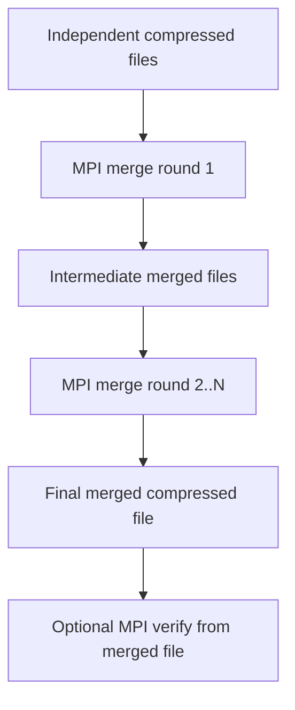

# PADOC Overview

`perflowai/padoc` is the trace compression and analysis package in this repository.
Its goal is not only to reduce Torch Profiler trace size, but to keep the compressed
representation analyzable and reconstructable.

## Purpose

PADOC focuses on three linked tasks:

- parse raw profiler traces into a structured internal representation
- compress repeated event patterns and repeated call-tree structure
- analyze compressed traces without expanding them back to raw JSON first

In practice, PADOC is meant for large training or inference traces where storage,
load time, and memory pressure all matter.

## Core Modules

### Data model

- `event.py`
  - raw `Event`
  - merged/template-side `MergeEvent`
- `node.py`
  - trace tree nodes for raw and compressed traces
  - CPU/GPU nodes and template-reference nodes
- `trace.py`
  - `Trace` for raw traces
  - `CompressedTrace` for compressed traces
  - JSON/msgpack read/write helpers

### Compression

- `compressor.py`
  - `TemplateCompressor` is the main implementation
  - supports:
    - single-file compression
    - directory compression with one compressed file per source file
    - optional merge of independently compressed files
    - rank-by-rank decompression to avoid building one large raw trace in memory
- `slp.py`
  - value-level compression helpers for merged event fields

### Analysis

- `analysis.py`
  - `TraceAnalysis` entrypoint
- `hta/`
  - temporal breakdown
  - communication/computation overlap
  - GPU kernel breakdown
- `visitor.py`
  - ordered traversal over compressed events

### MPI helpers

- `compress_mpi_worker.py`
  - MPI worker for independent per-file compression
- `merge_mpi_worker.py`
  - MPI worker for hierarchical merge reduction
- `verify_mpi_worker.py`
  - MPI worker for parallel verify/decompression checks

## Main Objects

Use this as the short mental model:

1. `Trace`
   - raw trace loaded from profiler output
2. `TemplateCompressor`
   - transforms repeated structures into templates
3. `CompressedTrace`
   - compact trace representation with shared templates
4. `TraceAnalysis`
   - runs analysis directly on `CompressedTrace`

## Compression Modes

PADOC currently uses these execution modes.

### Single-rank

- load one file
- compress one rank trace
- write one compressed file
- optionally decompress and verify against the source file

### Multi-rank independent compression

This is the default directory mode.

- each source file is compressed independently
- output is one compressed file per source file
- this matches the real deployment assumption that each process owns its own profile
- it avoids forcing all ranks into one global compressed object up front

### Optional merged compression

Merge is now optional and disabled by default in the demo.

- first compress each source file independently
- then optionally merge the compressed outputs
- serial mode merges sequentially
- MPI mode uses hierarchical reduction:
  - round 1 merges many source files into `P` intermediate files
  - later rounds merge intermediate files until one file remains

This mode is useful for experimentation, but it is not required for the normal
independent-compression workflow.

## Memory Behavior

Recent changes were made specifically to reduce peak memory:

- directory loading is sequential, not threaded
- independent multi-rank compression processes one file at a time
- merged verify can write one decompressed rank file at a time instead of first
  reconstructing one large raw `Trace`
- `--skip_verify` avoids decompression entirely

`Trace` is mainly a comparison and reconstruction convenience type. The current
pipeline tries to avoid building one giant `Trace` for whole-directory workflows.

## Current Call Chains

### Single-rank

### Multi-rank independent compression

### Optional hierarchical MPI merge

## Demo Entrypoint

The main demo is:

- `examples/compressed_analyze/compress_demo.py`

It currently supports:

- `single-rank`
- `multi-rank`
- optional `multi-rank+merge`
- serial or MPI execution for the multi-rank stages
- timing breakdown by stage
- compressed memory distribution
- node statistics
- optional verify

Important demo arguments:

- `--multi_rank_input_dir`
  - run the multi-file workflow
- `--multi_rank_executor {serial,mpi}`
  - choose serial or MPI for independent compression and verify
- `--mpi_processes`
  - number of MPI processes
- `--mpi_merge_fanin`
  - reduction fan-in for hierarchical merge rounds
- `--run_merge`
  - opt in to the merged-compression experiment
- `--skip_verify`
  - skip decompression and correctness checks
- `--json_indent`
  - JSON output formatting
  - `> 0`: readable JSON
  - `<= 0`: compact JSON using `separators=(",", ":")`

## Verify Behavior

PADOC includes file-level and directory-level verification helpers.

- single-file verify compares reconstructed trace events to the source file
- multi-file verify maps files by rank, not only by file name
- MPI verify can:
  - verify independently compressed parts
  - verify a merged compressed file by rank

Failure messages are intended to explain the first concrete mismatch, for example:

- file list mismatch
- event count mismatch
- first mismatch at a specific event index

## Notes on Merge

The merged mode is implemented for experimentation and may not always provide the
best compression ratio. Its main value right now is:

- exploring cross-file template sharing
- measuring merge cost separately from independent compression
- testing hierarchical MPI reduction

If the goal is stable low-memory compression for real runs, the independent
multi-rank mode is the primary path.
