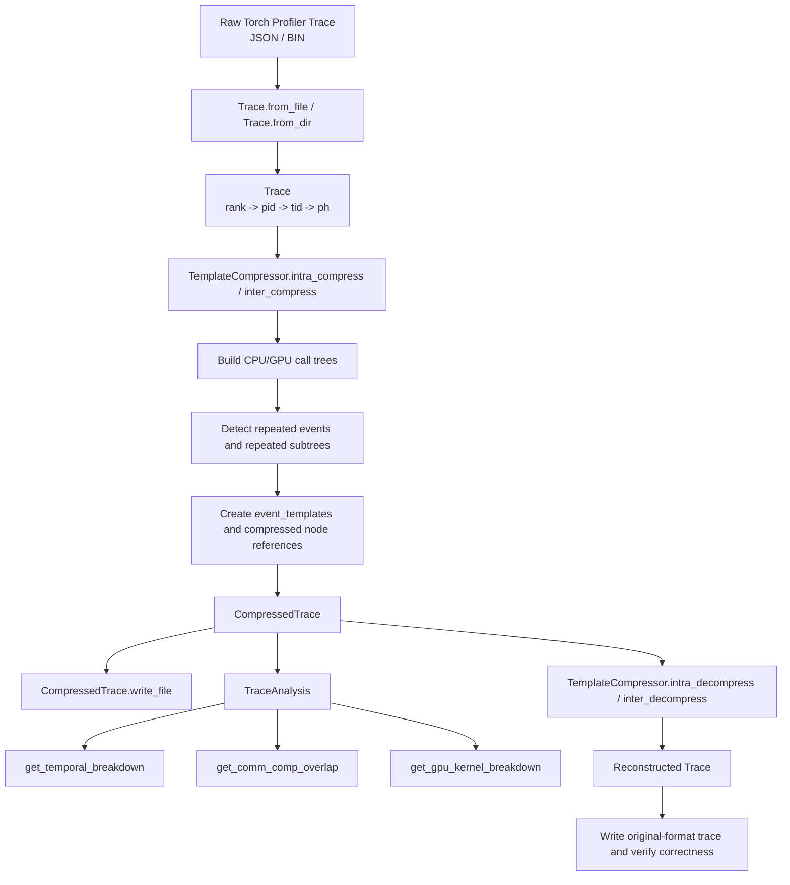

# PADOC Overview

`perflowai/padoc` is the core trace compression and analysis package in this repository.
Its job is not only to shrink Torch Profiler traces, but to keep them analyzable after
compression so the system can still run performance diagnostics on the compressed form.

## Purpose

PADOC focuses on three linked goals:

- parse raw profiler traces into an internal structured representation
- compress repeated event patterns and repeated subtrees in execution traces
- run performance analysis directly on compressed traces

In practice, this makes large training or inference traces cheaper to store and load,
while preserving the ability to compute metrics such as temporal breakdown, communication
vs. computation overlap, and GPU kernel breakdown.

## Core Modules

### 1. Data model

- `event.py`
  - defines `Event` for raw events
  - defines `MergeEvent` for merged/template events used during compression
- `node.py`
  - defines tree/node representations used by raw and compressed traces
  - includes CPU/GPU-side node structures used during traversal and reconstruction
- `trace.py`
  - defines `Trace` for raw traces
  - defines `CompressedTrace` for compressed traces
  - organizes data as `rank -> pid -> tid -> ph`

### 2. Compression

- `compressor.py`
  - defines the compressor interface
  - `TemplateCompressor` is the main implementation
  - builds trace trees, identifies repeated templates, and rewrites repeated structures
    into shared template references
- `slp.py`
  - provides value-level compression helpers
  - used for compressing repeated numeric/name patterns inside merged events

### 3. Analysis

- `analysis.py`
  - exposes `TraceAnalysis` as the user-facing analysis entry
- `hta/`
  - contains the actual analysis logic aligned with HTA-style metrics
  - currently includes temporal breakdown, communication analysis, and kernel breakdown
- `visitor.py`
  - provides iterators that traverse merged/compressed stream events in timestamp order

## Main Call Chain

The high-level path from input trace to compressed analysis is:

## End-to-End Flow

### Raw trace ingest

`Trace.from_file()` or `Trace.from_dir()` reads profiler output and converts each event
into an `Event`. The result is a hierarchical trace indexed by rank, process, thread,
and phase.

### Template-based compression

`TemplateCompressor` scans the trace, builds tree structure from event sequences,
matches structurally similar events/subtrees, and stores repeated patterns in shared
templates. The compressed result is a `CompressedTrace` plus a template/event table.

### Analysis on compressed trace

`TraceAnalysis` accepts a `CompressedTrace` and forwards analysis requests to the
implementations under `hta/`. This is the key design point: compression is meant to
preserve enough structure for analysis to operate without full expansion back to raw JSON.

### Reconstruction

For validation or export, the compressor can decompress a `CompressedTrace` back into a
regular `Trace`, which can then be written in original event format and compared with the
input trace.

## Example Entrypoints

The most useful examples are under `examples/compressed_analyze/`.

### `compress_demo.py`

Path:
- `examples/compressed_analyze/compress_demo.py`

Demonstrates:

- loading a raw trace
- compressing it with `TemplateCompressor`
- writing the compressed form
- decompressing it
- writing the reconstructed trace
- comparing reconstructed output with the original

This script is the best entrypoint for understanding storage reduction and correctness.

### `analyze_demo.py`

Path:
- `examples/compressed_analyze/analyze_demo.py`

Demonstrates:

- loading a raw trace or pre-compressed trace
- compressing if needed
- running `TraceAnalysis` on the compressed result
- comparing PADOC analysis outputs against HTA outputs

This script is the best entrypoint for understanding why PADOC exists beyond file-size
reduction: the compressed trace is still intended to support standard performance analysis.

## Minimal Mental Model

If you want one short mental model for this package:

1. `Trace` is the raw structured trace.
2. `TemplateCompressor` turns repeated execution patterns into reusable templates.
3. `CompressedTrace` is the compact but still analyzable representation.
4. `TraceAnalysis` runs performance analysis on that compressed representation.
