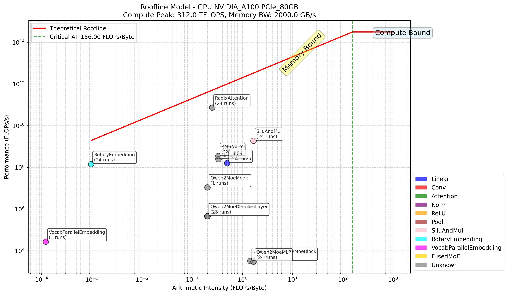

# Roofline Profiling

## Introduction

Roofline profiling is a performance analysis technique used to measure program performance on specific hardware platforms. It helps identify whether an application is compute-bound or memory-bound by comparing achieved performance against hardware capabilities.



## Install

You can install from source.

```
git clone https://github.com/yuyangJin/PerFlow-AI.git
cd PerFlow-AI
git checkout feat#104
pip install -e . # If your environment does not have torch, you can run `pip install -e .[roofline]`
```

## Usage


### PyTorch

```python
from perflowai.roofline import RooflineProfiler

roofline_proflie = RooflineProfiler(log_dir="hook_logs", 
                                    filter_models=["Qwen2"],
                                    rank = dist.get_rank(), # If you are in distributed inference
                                    device_id=gpu_id, # If you know the device id
                                    tp_rank=tp_rank, # If you know the tensor parallel rank
                                    ep_rank=moe_ep_rank, # If you know the moe ep rank
                                    pp_rank=pp_rank) # If you know the pipeline parallel rank

roofline_proflie.start()

# Your model run here
# Don't use cudagraph or inductor.
y = model(x)

# After model run
roofline_proflie.stop()
roofline_proflie.interactive_show()
```

### vLLM

1. Modify `vllm/worker/worker_base.py`:

```python
from perflowai.roofline import RooflineProfiler

# In WorkerBase.__init__ method:
        # You may get the parallel information from the `vllm_config` which is the input of `init` function
        self.roofline_profiler = RooflineProfiler(log_dir="hook_logs",
                                             filter_models=["Qwen2"],
                                             rank=self.rank,
                                             device_id=self.device_id,
                                             tp_rank=self.tp_rank,
                                             ep_rank=self.ep_rank,
                                             pp_rank=self.pp_rank)
        self.roofline_profiler.start()
```

2. Run in eager mode (disable cudagraph and inductor)

```python
from perflowai.roofline import RooflineProfiler

roofline_profiler = RooflineProfiler(log_dir="hook_logs") # You need to specify the same log_dir as you used in your code before
# Don't call start method, because it will clean the log_dir
roofline_profiler.interactive_show()
```

### sglang

1. Modify `sglang/python/sglang/srt/model_executor/model_runner.py`

```python
from perflowai.roofline import RooflineProfiler

# In ModelRunner.__init__ method:
        # The `gpu_id`, `tp_rank`, `moe_ep_rank`, `pp_rank` are inputs of `init` function
        self.roofline_proflie = RooflineProfiler(log_dir="hook_logs", 
                                         filter_models=["Qwen2"],
                                         device_id=gpu_id,
                                         tp_rank=tp_rank,
                                         ep_rank=moe_ep_rank,
                                         pp_rank=pp_rank)

        self.roofline_proflie.start()
```

2. Run with eager mode:

```bash
python3 -m sglang.bench_offline_throughput \
    --model-path $MODEL_PATH \
    --dataset-path $DATASET_PATH \
    --num-prompts 8 \
    --pp-size 1 \
    --tp-size 1 \
    --dp-size 2 \
    --random-input-len 64 \
    --random-output-len 128 \
    --disable-cuda-graph
```

3. After running, you can run the following code in a new file to get the roofline plot:

```python
from perflowai.roofline import RooflineProfiler

roofline_proflie = RooflineProfiler(log_dir="hook_logs") # You need to specify the same log_dir as you used in your code before
# Don't call start method, because it will clean the log_dir
roofline_proflie.interactive_show()
```

## Extra

To add support for additional operators, modify `PerFlow-AI/perflowai/roofline/ops_calculator.py`:

```python
class OpsCalculator:
    def calculate_leaf_node_ops(self, node):
        # Add your operator calculation here
        if node.name == "your_operator":
            return self._calculate_your_operator_ops(input_info, output_info)
        # ... existing code
    
    def _calculate_your_operator_ops(self, node):
        # Implement your operator's FLOPs and memory access calculation
        # Get input tensor info
        input_tensor = input_info[0] if isinstance(input_info, list) else input_info
        input_shape = input_tensor.get('shape', [])
        input_dtype = input_tensor.get('dtype', 'torch.float32')
        # Get output tensor info
        output_shape = output_info.get('shape', []) if isinstance(output_info, dict) else []
        # Calculate and return (flops, memory_access)
```
PR contributions for additional operator support are welcome.